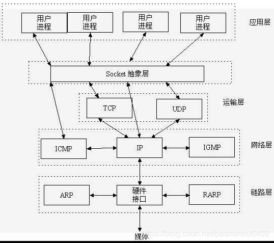
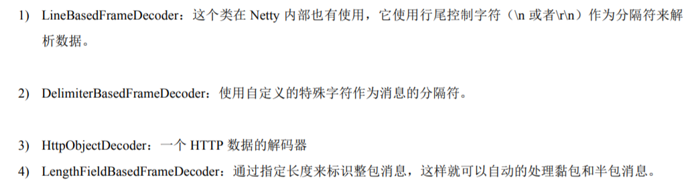
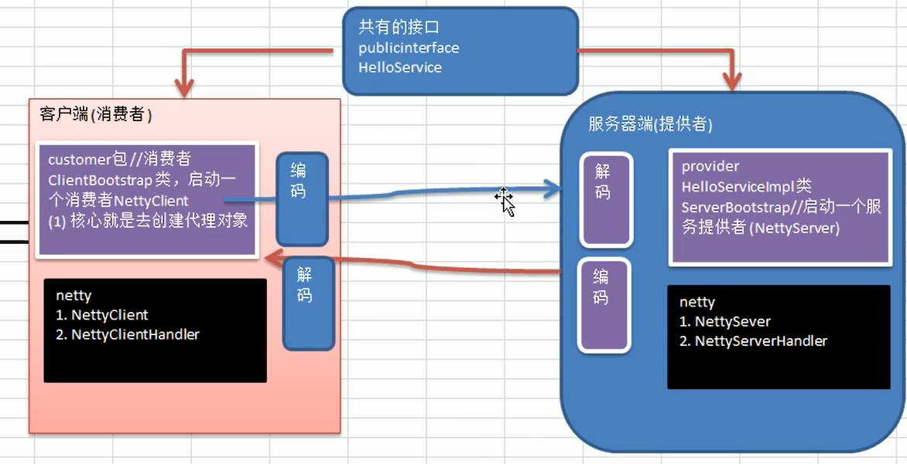

## 1.1 Java 网络编程

### BufferedReader 和 BufferedWriter

为了提高字符流读写的效率，引入了缓冲机制，进行字符批量的读写，提高了单个字符读写的效率。`BufferedReader`用于加快读取字符的速度，`BufferedWriter`用于加快写入的速度

`BufferedReader`和`BufferedWriter`类各拥有`8192`个字符的缓冲区。当`BufferedReader`在读取文本文件时，会先尽量从文件中读入字符数据并放满缓冲区，而之后若使用`read()`方法，会先从缓冲区中进行读取。如果缓冲区数据不足，才会再从文件中读取，使用`BufferedWriter`时，写入的数据并不会先输出到目的地，而是先存储至缓冲区中。如果缓冲区中的数据满了，才会一次对目的地进行写出。

**Socket**



 Socket是应用层与TCP/IP协议族通信的中间软件抽象层，它是一组接口。在设计模式中，Socket其实就是一个门面模式，它把复杂的TCP/IP协议族隐藏在Socket接口后面，对用户来说，一组简单的接口就是全部，让Socket去组织数据，以符合指定的协议。


早期的java网络编程只支持有本地系统套接字库提供的阻塞函数

**关键点**


（1）ServerSocket的accept()方法会一直阻塞到一个连接建立，随后返回一个新的Socket用于客户端和服务端之间的通信，给ServerSocket将继续监听传入的连接。

（2）readLine()方法将会阻塞，直到在 处一个由换行符或者回车符结尾的字符串被 读取。

这段代码片段将只能同时处理一个连接，要管理多个并发客户端，需要为每个新的客户端 Socket 创建一个新的 Thread线程。

产生的问题：

（1）在任何时候都有可能有大量的线程处于休眠的状态，只是等待输入或者输出数据就绪，造成资源浪费

（2）虚拟机需要为每一个运行的线程分配栈内存。

（3）线程之间的切换问题

## 1.2 NIO（非阻塞）

（1） 可以使用setsockopt()方法配置**套接字**，以便读写调用在没有数据的时候立即返回。

（2） 可以使用操作系统的时间通知API（多路复用）注册一组非阻塞的套接字。


Selector 选择器是Java非阻塞I/O实现的关键。他使用了事件通知API以确定在一组非阻塞套接字中有哪些已经就绪能够进行I/O相关操作因为他可以在任何时间检查任意的读写操作的完成状态。

（1）使用较少的线程便可以处理许多连接，因此也减少了内存管理和上下文切换所带来开销；

（2）当没有 I/O 操作需要处理的时候，线程也可以被用于其他任务。

## 1.3 NIO


**I/O模型基本说明**

java共支持3种网络编程模型I/O模型：BIO、NIO、AIO

BIO：同步并阻塞

使用场景：适用于连接数目比较小且固定的架构，服务器资源要求比较高

NIO：同步非阻塞

使用场景：适用于连接数目多且连接比较短的架构，（聊天服务器，弹幕，）

AIO：异步非阻塞

使用场景：连接数目多且连接比较长（相册服务器）

**BIO案例**

```java
package com.fy.Bio;

import java.io.IOException;
import java.io.InputStream;
import java.net.ServerSocket;
import java.net.Socket;
import java.util.concurrent.ExecutorService;
import java.util.concurrent.Executors;

/**
 * Bio方式
 */
public class BIOServer {
    public static void main(String[] args) throws Exception{
        //创建一个线程池
        //如果有客户端连接 就创建一个线程 与之通信

        //创建一个线程池
        ExecutorService newCachedThreadPool = Executors.newCachedThreadPool();
        //创建serversocket
        ServerSocket serverSocket = new ServerSocket(6666);
        System.out.println("服务启动了");
        while (true){
            //监听 等待客户端连接
           final Socket accept = serverSocket.accept();
            System.out.println("连接到一个客户端");
            //创建一个线程 与之通信
            newCachedThreadPool.execute(new Runnable() {
                public void run() {
                    handle(accept);
                }
            });
        }
    }
    //编写一个handle方法
    public static void handle(Socket socket) {
        try {
            System.out.println("线程id:"+Thread.currentThread().getId()+"  线程名字"+Thread.currentThread().getName());
            byte[] bytes = new byte[1024];
            //获取字节流
            InputStream inputStream = socket.getInputStream();
            //循环读取客服端发来的请求
            while (true){
                System.out.println("线程id:"+Thread.currentThread().getId()+"  线程名字"+Thread.currentThread().getName());
                //一byte的形式、大小读取放在缓存区
                int read = inputStream.read(bytes);
                if(read!=-1){
                    //输出客户端发的数据
                    //转成String形式输出
                    System.out.println(new String(bytes,0,read));
                }else {
                    break;
                }
            }
        }catch (Exception e){
            e.printStackTrace();
        }finally {
            System.out.println("关闭client的连接");
            try {
                socket.close();
            } catch (IOException e) {
                e.printStackTrace();
            }
        }


    }
}
```

NIO的三大核心部分：Channel（通道）、Buffer（缓冲区）、Selector（选择器）

NIO是一个面向缓冲区、或者面向块编程的，数据读取之后再稍后进行处理的缓冲区，需要时可以再缓冲区移动，这就增加了处理过程中的灵活性，所以拥有非阻塞的高伸缩性网络

**NIO和BIO的比较**

1.BIO以流的方式处理数据，而NIO以块的方法处理数据，快I/O的效率比流I/O的快的多

2.BIO是阻塞的，NIO是非阻塞的

3.BI0基于字节流和字符流进行操作，而NIO基于Channel(通道)和Buffer(缓冲区)进行操作，数据总是从通道读取到缓冲区中，或者从缓冲区写入到通道中。Selector(选择器)用于监听多个通道的事件(比如:连接请求，数据到达等)，因此使用单个线程就可以监听多个客户端通道。

```java
package com.fy.Nio;

import java.nio.IntBuffer;

public class NIOServer {
    public static void main(String[] args) {
        //创建一个IntBuffer 大小为2 既可以存放5个Int
        IntBuffer intBuffer = IntBuffer.allocate(5);

        //intBuffer.capacity()表示大小
        for (int i = 0; i < intBuffer.capacity(); i++) {
            intBuffer.put(i*2);
        }

        //将buffer进行转换 读写切换
        intBuffer.flip();

        //输出
        while (intBuffer.hasRemaining()){
            System.out.println(intBuffer.get());
        }

    }
}
```

### Buffer缓存区

缓冲区(Buffer) :缓冲区本质上是一个可以读写数据的内存块，可以理解成是一个容器对象(含数组)，该对象提供了一组方法，可以更轻松地使用内存块，，缓冲区对象内置了一些机制，能够跟踪和记录缓冲区的状态变化情况。Channel 提供从文件、网络读取数据的渠道，但是读取或写入的数据都必须经由Buffer。


### Channel 通道

通道可以同时进行读写，而流只能读或者只能写.
通道可以实现异步读写数据
通道可以从缓冲读数据，也可以写数据到缓冲:

写入

```java
package com.fy.Nio;

import com.sun.org.apache.bcel.internal.util.ClassPath;

import java.io.FileOutputStream;
import java.nio.ByteBuffer;
import java.nio.channels.FileChannel;

public class NIOFileChannel01 {
    public static void main(String[] args) throws Exception{
        String str = "hello,Netty!";
        //创建一个输出流File
        FileOutputStream fileOutputStream = new FileOutputStream("D:\\file01.txt");

        //通过fileOutputStream获取对应的FileChannel
        //这个fileChannel 真实类型是 FileChannelImpl
        FileChannel channel = fileOutputStream.getChannel();

        //创建一个缓冲区ByteBuffer
        ByteBuffer byteBuffer = ByteBuffer.allocate(1024);

        //将str放入不byteBuffer
        byteBuffer.put(str.getBytes());

        //对byteBuffer进行反转
        byteBuffer.flip();

        //从channel写入
        channel.write(byteBuffer);
    }
}
```

读出

```java
package com.fy.Nio;

import java.io.File;
import java.io.FileInputStream;
import java.nio.Buffer;
import java.nio.ByteBuffer;
import java.nio.channels.FileChannel;

public class NIOFileChannel02 {
    public static void main(String[] args) throws Exception{
        //创建文件的输出流
        File file = new File("D:\\file01.txt");
        FileInputStream fileInputStream = new FileInputStream(file);
        //通过fileInputStream获得对应的FileChannel 实际类型 FileChannelImpl
        FileChannel channel = fileInputStream.getChannel();
        //创建缓冲区
        ByteBuffer byteBuffer = ByteBuffer.allocate(((int) file.length()));
        //将通道的数据读入到Buffer
        channel.read(byteBuffer);
        //将byteBuffer 的字节数据 转成String
        System.out.println(new String(byteBuffer.array()));
        fileInputStream.close();
    }
}
```

用一个buffer写入读出

```java
package com.fy.Nio;

import java.io.FileInputStream;
import java.io.FileOutputStream;
import java.nio.ByteBuffer;
import java.nio.channels.FileChannel;

public class NIOFileChannel03 {
    public static void main(String[] args) throws Exception{
        FileInputStream fileInputStream = new FileInputStream("1.txt");
        FileChannel inputStreamChannel = fileInputStream.getChannel();

        FileOutputStream fileOutputStream = new FileOutputStream("2.txt");
        FileChannel outputStreamChannel = fileOutputStream.getChannel();

        ByteBuffer byteBuffer = ByteBuffer.allocate(512);

        while (true){
            //清空Buffer 不清空 position limit相等
            byteBuffer.clear();
            int read = inputStreamChannel.read(byteBuffer);
            System.out.println("Read="+read);
            //表示读完
            if(read==-1){
                break;
            }
            byteBuffer.flip();
            outputStreamChannel.write(byteBuffer);
        }
        fileInputStream.close();
        fileOutputStream.close();
    }
}
```

拷贝

```java
package com.fy.Nio;

import java.io.FileInputStream;
import java.io.FileOutputStream;
import java.nio.channels.FileChannel;

public class NIOFileChannel04 {
    public static void main(String[] args) throws Exception {
        FileInputStream fileInputStream = new FileInputStream("1.jpg");
        FileOutputStream fileOutputStream = new FileOutputStream("2.jpg");

        //获得对应的channel
        FileChannel inputStreamChannel = fileInputStream.getChannel();
        FileChannel outputStreamChannel = fileOutputStream.getChannel();

        //使用transferForm完成拷贝
        outputStreamChannel.transferFrom(inputStreamChannel,0,inputStreamChannel.size());

        outputStreamChannel.close();
        inputStreamChannel.close();
        fileInputStream.close();
        outputStreamChannel.close();

    }
}
```

Buffer与Channel的注意事项和细节

1.ByteBuffer支持类型化的put和get，put放入什么类型，get就应该使用相应的数据类型来取出，否则异常

2.可以将一个普通Buffer转为只读   Buffer(buffer.asReadOnlyBuffer())

3.MapperByteBuffer:可以文件直接再内存(推外内存)中修改，操作系统不需要拷贝一次

**ScatteringAndGathering**

Scatting:将数据写入到buffer时，可以采用buffer数组，依次写入【分散】

Gathering:从buffer读取数据时，可以采用buffer数据，依次读 【聚合】

```java
package com.fy.Nio;

import java.net.InetSocketAddress;
import java.nio.Buffer;
import java.nio.ByteBuffer;
import java.nio.channels.ServerSocketChannel;
import java.nio.channels.SocketChannel;
import java.util.Arrays;

/**
 * Scatting:将数据写入到buffer时，可以采用buffer数组，依次写入【分散】
 * Gathering:从buffer读取数据时，可以采用buffer数据，依次读 【聚合】
 */
public class ScatteringAndGatheringTest {
    public static void main(String[] args) throws Exception {
        //使用ServerSocketChannel socketChannel
        ServerSocketChannel serverSocketChannel = ServerSocketChannel.open();
        InetSocketAddress inetSocketAddress = new InetSocketAddress(7000);
        //绑定端口并且启动
        serverSocketChannel.socket().bind(inetSocketAddress);

        //创建buffer数组
        ByteBuffer[] byteBuffers = new ByteBuffer[2];
        byteBuffers[0] = ByteBuffer.allocate(5);
        byteBuffers[1] = ByteBuffer.allocate(3);
        
        //等待客户端链接
        SocketChannel socketChannel = serverSocketChannel.accept();
        System.out.println("客户端已连接!!");
        int messageLength = 8;

        //循环读取
        while (true){
            long byteRead = 0;
            while (byteRead<messageLength){
                long l = socketChannel.read(byteBuffers);
                System.out.println("l的大小"+l);
                //累计读取的字节数
                byteRead += l;
                //使用流打印 看看buffer的position limit
                Arrays.asList(byteBuffers).stream().map(buffer -> "position=" + buffer.position() + ", limit="+buffer.limit()).forEach(System.out::println);
            }
            //将所有的buffer进行flip
            Arrays.asList(byteBuffers).forEach(buffer -> buffer.flip());
            //将buffer输出
            long byteWrite = 0;
            while (byteWrite<messageLength){
                long w = socketChannel.write(byteBuffers);
                System.out.println("w的大小"+w);
                byteWrite += w;
            }
            Arrays.asList(byteBuffers).forEach(buffer -> buffer.clear());
            System.out.println("byteRead = "+byteRead+" byteWrite = "+ byteWrite + " messageLength = "+messageLength);
        }
    }
}
```

### Selector(选择器)

Java的NIO，用非阻塞的I0方式。可以用一个线程，处理多个的客户端连接，就会使用到Selector(选择器)

Selector能够检测多个注册的通道上是否有事件发生(注意:多个Channel以事件的方式可以注册到同一Selector)，如果有事件发生，便获取事件然后针对每个事件进行相应的处理。这样就可以只用一一个单线程去管理多个通道，也就是管理多个连接和请求。

**注意事项**

NIO中的ServerSocketChannel功能类似ServerSocket, SocketChanne功能类似Socket

selector.select()//阻塞
selector.select(1000);//阻塞1000毫秒，在1000毫秒后返回
selector.wakeup();//唤醒selector
selector.selectNow();//不阻塞，立马返还

**网络编译原理分析**

当客户端连接时，会通过ServerSocketChannel得到SocketChannel；

将socketChannel注册到Selector,上register(Selector sel, int ops),一个selector上可以注册多个SocketChannel；

注册后返回一个SelectionKey,会和该Selector关联(集合)；

Selector进行监听select方法，返回有事件发生的通道的个数；

进一步得到各个SelectionKey (有事件发生)；

在通过SelectionKey反向获取SocketChannel ,方法channel()；

可以通过得到的channel , 完成业务处理

**ServerSocketChannel与socketChannel的区别**

ServerSocketChannel在服务器监听新的客户端Socket连接

socketChannel：具体负责进行读写操作

```java
package com.fy.Nio;

import java.net.InetSocketAddress;
import java.nio.ByteBuffer;
import java.nio.channels.SelectionKey;
import java.nio.channels.Selector;
import java.nio.channels.ServerSocketChannel;
import java.nio.channels.SocketChannel;
import java.util.Iterator;
import java.util.Set;

public class NIOSelectorServer {
    public static void main(String[] args) throws Exception {
        //创建serverSocketChannel
        ServerSocketChannel serverSocketChannel = ServerSocketChannel.open();
        //得到一个Selector对象
        Selector selector = Selector.open();

        //绑定一个端口 进行监听
        serverSocketChannel.socket().bind(new InetSocketAddress(6666));
        //设置为非阻塞
        serverSocketChannel.configureBlocking(false);

        //把serverSocketChannel注册到selector关心事件 OP_ACCEPT
        serverSocketChannel.register(selector, SelectionKey.OP_ACCEPT);

        //等待客户端连接
        while (true){
            if(selector.select(1000) == 0){
                System.out.println("无连接，服务器等待1秒");
                continue;
            }
            //如果返回的>0，就获取到相关的selectionKey集合
            //1.如果返回的>0， 表示已经获取到关注的事件
            //2. selector. selectedKeys() 返回关注事件的集合
            //通过selectionKeys反向获取通道
            Set<SelectionKey> selectionKeys = selector.selectedKeys();

            //遍历Set<SelectionKey> 使用迭代器遍历
            Iterator<SelectionKey> keyIterator = selectionKeys.iterator();
            while (keyIterator.hasNext()){
                SelectionKey key = keyIterator.next();
                System.out.println("key="+key);
                //根据key对相关事件进行处理
                if(key.isAcceptable()){
                    //如果是OP_ACCEPT 有新的客户端连接
                    SocketChannel socketChannel = serverSocketChannel.accept();
                    System.out.println("第一次连接");
                    socketChannel.configureBlocking(false);
                    socketChannel.register(selector,SelectionKey.OP_READ, ByteBuffer.allocate(1024));
                }
                if(key.isReadable()){
                    //如果发生 OP_READ
                    SocketChannel channel = (SocketChannel) key.channel();
                    //获得该channel关联的buffer
                    ByteBuffer buffer = (ByteBuffer) key.attachment();
                    channel.read(buffer);
                    System.out.println("form 客户端"+new String(buffer.array()));
                }
                //手动移除当前的selectionKey，防止重复操作
                keyIterator.remove();
            }
        }
    }
}
```

```java
package com.fy.Nio;

import java.net.InetSocketAddress;
import java.nio.ByteBuffer;
import java.nio.channels.SocketChannel;

public class NIOSelectClient {
    public static void main(String[] args) throws Exception {
        //得到一个网络渠道
        SocketChannel socketChannel = SocketChannel.open();
        //设置非阻塞
        socketChannel.configureBlocking(false);
        //提供服务器地址端口
        InetSocketAddress inetSocketAddress = new InetSocketAddress("127.0.0.1", 6666);
        //连接服务器
        if(!socketChannel.connect(inetSocketAddress)){
            while (!socketChannel.finishConnect()){
                System.out.println("连接需要时间，客户端不会阻塞，可以做其他工作");
            }
        }
        //如果连接成功，就发送数据
        String str = "fyyyy" ;
        //wrap可以检测到byte数组中有多少字节
        ByteBuffer buffer = ByteBuffer.wrap(str.getBytes());
        socketChannel.write(buffer);
    }
}
```

### **综合案例**

```java
package com.fy.Nio;

import java.net.InetSocketAddress;
import java.nio.ByteBuffer;
import java.nio.channels.SocketChannel;

public class NIOSelectClient {
    public static void main(String[] args) throws Exception {
        //得到一个网络渠道
        SocketChannel socketChannel = SocketChannel.open();
        //设置非阻塞
        socketChannel.configureBlocking(false);
        //提供服务器地址端口
        InetSocketAddress inetSocketAddress = new InetSocketAddress("127.0.0.1", 6666);
        //连接服务器
        if(!socketChannel.connect(inetSocketAddress)){
            while (!socketChannel.finishConnect()){
                System.out.println("连接需要时间，客户端不会阻塞，可以做其他工作");
            }
        }
        //如果连接成功，就发送数据
        String str = "fyyyy" ;
        //wrap可以检测到byte数组中有多少字节
        ByteBuffer buffer = ByteBuffer.wrap(str.getBytes());
        socketChannel.write(buffer);
    }
}
```

```java
package com.fy.Nio.groupChat;

import java.io.IOException;
import java.net.InetSocketAddress;
import java.nio.ByteBuffer;
import java.nio.channels.SelectionKey;
import java.nio.channels.Selector;
import java.nio.channels.SocketChannel;
import java.util.Iterator;
import java.util.Scanner;

//聊天客户端
public class groupChatClient {
    //定义相关属性
    private final String HOST = "127.0.0.1";
    private final int PORT = 6666;
    private Selector selector;
    private SocketChannel socketChannel;
    private String username;

    //完成初始化
    public groupChatClient() throws IOException {
        selector = Selector.open();
        socketChannel = SocketChannel.open(new InetSocketAddress(HOST,PORT));
        socketChannel.configureBlocking(false);
        socketChannel.register(selector, SelectionKey.OP_READ);
        //得到username
        username = socketChannel.getLocalAddress().toString().substring(1);
        System.out.println(username + "is ok.......");
    }
    //发生信息
    public void sendInfo(String info){
        info = username + "说: " + info;
        try {
            socketChannel.write(ByteBuffer.wrap(info.getBytes()));
        } catch (IOException e) {
            e.printStackTrace();
        }

    }
    //读取从服务器端回复的消息
    public void readInfo(){
        try {
            int count = selector.select();
            //如果有可用的通道
            if(count>0){
                Iterator<SelectionKey> iterator = selector.selectedKeys().iterator();
                while (iterator.hasNext()){
                    SelectionKey key = iterator.next();
                    SocketChannel channel = (SocketChannel)key.channel();
                    channel.configureBlocking(false);
                    //得到一个buffer
                    ByteBuffer buffer = ByteBuffer.allocate(1024);
                    channel.read(buffer);
                    String msg = new String(buffer.array());
                    System.out.println(msg.trim());
                }
                iterator.remove();
            }else {
                //System.out.println("没有通道可以用");
            }
        } catch (IOException e) {
            e.printStackTrace();
        }

    }

    public static void main(String[] args) throws IOException {
        groupChatClient client = new groupChatClient();
        new Thread(){
            @Override
            public void run() {
                while(true){
                    client.readInfo();
                    try {
                        Thread.currentThread().sleep(3000);
                    } catch (InterruptedException e) {
                        e.printStackTrace();
                    }
                }
            }
        }.start();
        Scanner scanner = new Scanner(System.in);
        while (scanner.hasNextLine()){
            String s = scanner.next();
            client.sendInfo(s);
        }
    }
}
```

## 1.4 Netty

**原生NIO存在的问题**

NIO的类库和API繁杂，使用麻烦:需要熟练掌握Selector、ServerSocketChannel、SocketChannel、ByteBuffer 等。

需要具备其他的额外技能:要熟悉Java 多线程编程，因为NIO编程涉及到Reactor模式，你必须对多线程和网络编程非常熟悉，才能编写出高质量的NIO 程序。

开发工作量和难度都非常大:例如客户端面临断连重连、网络闪断、半包读写、失败缓存、网络拥塞和异常流的处理等等。

JDK NIO的Bug:例如臭名昭著的Epoll Bug，它会导致Selector空轮询，最终导致CPU 100%。直到JDK 1.7版本该问题仍旧存在，没有被根本解决。

**Netty的优点**

设计优雅:适用于各种传输类型的统- - API 阻塞和非阻塞Socket;基于灵活且可扩展的事件模型，可以清晰地分离关注点;高度可定制的线程模型- 单线程，一个或多个线程池.
使用方便:详细记录的Javadoc，用户指南和示例;没有其他依赖项，JDK 5 (Netty3.x) 或6 (Netty4.x) 就足够了。
高性能、吞吐量更高:延迟更低;减少资源消耗;最小化不必要的内存复制。
安全:完整的SSL/TLS和StartTLS支持。
社区活跃、不断更新:社区活跃，I版本迭代周期短，发现的Bug 可以被及时修复，同时，更多的新功能会被加入


Netty抽象出两组线程池，BossGroup 专门负责接收客户端连接，WorkerGroup 专门负责网络读写操作。
NioEventLoop表示一个不断循环执行处理任务的线程，每个NioEventLoop 都有一个selector,用于监听绑定在其上的socket网络通道。
NioEventLoop内部采用串行化设计，从消息的读取~>解码->处理->编码->发送，始终由I0线程NioEventLoop负责
NioEventLoopGroup下包含多个NioEventLoop
每个NioEventLoop中包含有一个Selector，一 个taskQueue
每个NioEventLoop的Selector上可以注册监听多个NioChannel
每个NioChannel只会绑定在唯一的 NioEventLoop上
每个NioChannel都绑定有一个 自己的ChannelPipeline

### Netty核心组件

#### BootStrap、ServerBootStrap

Bootstrap意思是引导，一个Netty应用通常由一个Bootstrap开始，主要作用是配置整个Netty程序，串联各个组件，Netty 中Bootstrap类是客户端程序的启动引导类，ServerBootstrap是服务端启动引导类
常见的方法有
public ServerBootstrap group(EventLoopGroup parentGroup, EventLoopGroup childGroup)，该方法
用于服务器端，用来设置两个EventLoop
public B group(EventLoopGroup group)，该方法用于客户端，用来设置一 个EventLoopGroup
public B channel(Class<? extends C> channelClass)，该方法用来设置一一个服务器端的通道实现
public <T> B option(ChannelOption<T> option, T value)，用来给ServerChannel添加配置
public <T> ServerBootstrap childOption(ChannelOption<T> childOption, T value),用来给接收到的
通道添加配置 
public ServerBootstrap childHandler(ChannelHandler childHandler)， 该方法用来设置业务处理类
(自定义的handler) 用于bossGroup
public ChannelFuture bind(int inetPort)， 该方法用于服务器端，用来设置占用的端口号
public ChannelFuture connect(String inetHost, int inetPort)，该方法用于客户端，用来连接服务器
端

#### Future、ChannelFuture

Netty中所有的IO操作都是异步的，不能立刻得知消息是否被正确处理。但是可以过一会等它执行完成或者直接注册一个监听，具体的实现就是通过Future 和ChannelFutures，他们可以注册一个监听，当操作执行成功或失败时监听会自动触发注册的监听事件。

Channel channel()，返回当前正在进行I0操作的通道

ChannelFuturesync()， 等待异步操作执行完毕

#### Channel

1. Netty网络通信的组件，能够用于执行网络I/0 操作。
2. 通过Channel可获得当前网络连接的通道的状态
3. 通过Channel可获得网络连接的配置参数( 例如接收缓冲区大小)
4. Channel提供异步的网络I/O操作(如建立连接，读写，绑定端口)，异步调用意味着任何|/O调用都将立即回，并且不保证在调用结束时所请求的I/O操作已完成
5. 调用立即返回一个ChannelFuture实例，通过注册监听器到ChannelFuture .上，可以I/0操作成功、失败或取消时回调通知调用方
6. 支持关联I/0操作与对应的处理程序
7. 不同协议、不同的阻塞类型的连接都有不同的Channel类型与之对应，常用的Channel类型:

- NioSocketChannel,开步的各户端TCP Socket连按。
- NioServerSocketChannel,异步的服务器端TCP Socket连接。
- NioDatagramChannel,异步的UDP连接。
- NioSctpChannel,异步的客户端Sctp 连接。
- NioSctpServerChannel,异步的Sctp 服务器端连接，这些通道涵盖了UDP和TCP网络IO以及文件IO。

#### Selector

1. Netty基于Selector对象实现/0多路复用，通过Selector 一一个线程可以监听多个连接的Channel事件。
2. 当向一个Selector中注册Channel后，Selector 内部的机制就可以自动不断地查询(Select)这些注册的Channel是否有已就绪的I/0 事件(例如可读，可写，网络连接完成等)，这样程序就可以很简单地使用一个线程高效地管理多个Channel

#### ChannelHandle

1. ChannelHandler是一一个接口，处理I/O事件或拦截I/O操作，并将其转发到其
2. ChannelPipeline(业务处理链)中的下一个处理程序。
3. ChannelHandler本身并没有提供很多方法，因为这个接口有许多的方法需要实现，方便使用期间，可以继承它的子类

#### ChannelPipeline

ChannelPipeline是一个Handler的集合，它负责处理和拦截inbound或者outbound的事件和操作，相当于一个贯穿Netty的链。(也可以这样理解:ChannelPipeline是保存ChannelHandler的List,用于处理或拦截Channel的入站
事件和出站操作)
ChannelPipeline实现了一种高级形式的拦截过滤器模式，使用户可以完全控制事件的处理方式，以及Channel中各个的ChannelHandler如何相互交互


#### ChannelHandleContext

1. 保存Channel相关的所有上下文信息，同时关联一个ChannelHandler对象,即ChannelHandlerContext中包含一个具体的事件处理器ChannelHandler，
2. 同时ChannelHandlerContext中也绑定了对应的pipeline和Channel的信息，方便对ChannelHandler进行调用常用方法

#### ChannelOption

Netty在创建Channel 实例后,一般都需要设置ChannelOption参数。
ChannelOption参数如下:


#### EventLoopGroup和其实现类NioEventLoopGroup

EventLoopGroup是一组EventLoop 的抽象, Netty为了更好的利用多核CPU资源，一般会有多个EventLoop
同时工作，每个EventLoop 维护着一个Selector 实例。
EventLoopGroup提供next 接口，可以从组里面按照一定规则获取其中一个EventLoop 来处理任务。在Netty
服务器端编程中，我们一般都需要提供两个EventLoopGroup， 例如: BossEventLoopGroup 和WorkerEventL oopGroup。
通常一个服务端口即一个ServerSocketChannel 对应一个Selector和一个EventL oop线程。BossEventLoop负责接收客户端的连接并将SocketChannel 交给WorkerEventLoopGroup 来进行I0处理


#### Unpooled类

Netty提供一个专门用来操作缓冲区(即Netty的数据容器)的工具类


### Netty——群聊系统


服务端

```java
package com.fy.Netty.groupChat;


import io.netty.bootstrap.ServerBootstrap;
import io.netty.channel.*;
import io.netty.channel.nio.NioEventLoopGroup;
import io.netty.channel.socket.SocketChannel;
import io.netty.channel.socket.nio.NioServerSocketChannel;
import io.netty.handler.codec.string.StringDecoder;
import io.netty.handler.codec.string.StringEncoder;

//netty聊天 服务端
public class GroupChatServer {
    //设置端口号
    private int port;

    public GroupChatServer(int port)  {
        this.port = port;
    }
    public void run() throws Exception {
        EventLoopGroup bossGroup = new NioEventLoopGroup(1);
        EventLoopGroup workerGroup = new NioEventLoopGroup();

        try {
            ServerBootstrap serverBootstrap = new ServerBootstrap();
            serverBootstrap.group(bossGroup,workerGroup)
                    .channel(NioServerSocketChannel.class)
                    .option(ChannelOption.SO_BACKLOG,120)
                    .childOption(ChannelOption.SO_KEEPALIVE,true)
                    .childHandler(new ChannelInitializer<SocketChannel>() {
                        @Override
                        protected void initChannel(SocketChannel ch) throws Exception {
                            ChannelPipeline pipeline = ch.pipeline();
                            pipeline.addLast("stringDecoder",new StringDecoder());
                            pipeline.addLast("stringEncoder",new StringEncoder());
                            pipeline.addLast("GroupChatServerHandle",new GroupChatServerHandle());
                        }
                    });
            System.out.println("服务器已经启动");
            ChannelFuture cf = serverBootstrap.bind(port).sync();
            cf.channel().closeFuture().sync();
        } finally {
            bossGroup.shutdownGracefully();
            workerGroup.shutdownGracefully();
        }

    }

    public static void main(String[] args) throws Exception {
        new GroupChatServer(6660).run();
    }
}
```

服务处理器

```java
package com.fy.Netty.groupChat;

import io.netty.channel.Channel;
import io.netty.channel.ChannelHandlerContext;
import io.netty.channel.SimpleChannelInboundHandler;
import io.netty.channel.group.ChannelGroup;
import io.netty.channel.group.DefaultChannelGroup;
import io.netty.util.concurrent.GlobalEventExecutor;

public class GroupChatServerHandle extends SimpleChannelInboundHandler<String> {
    //定义一个channelGroup 管理所有的channel
    //GlobalEventExecutor.INSTANCE：全局事件执行器 是一个单例
    private static ChannelGroup channelGroup = new DefaultChannelGroup(GlobalEventExecutor.INSTANCE);

    /**
     * handlerAdded 表示连接建立 一旦连接 第一执行
     * 将当前的channel加入到channelGroup中
     * @param ctx
     * @throws Exception
     */
    @Override
    public void handlerAdded(ChannelHandlerContext ctx) throws Exception {
        Channel channel = ctx.channel();
        channelGroup.writeAndFlush("[客户端]"+channel.remoteAddress()+"加入聊天\n");
        channelGroup.add(channel);
    }

    /**
     * 表示channel 处于活跃状态 提示xxx上线
     * @param ctx
     * @throws Exception
     */
    @Override
    public void channelActive(ChannelHandlerContext ctx) throws Exception {
        System.out.println(ctx.channel().remoteAddress()+"上线了");
    }

    /**
     * 表示channel 处于不活跃状态 提示xxx上线
     * @param ctx
     * @throws Exception
     */
    @Override
    public void channelInactive(ChannelHandlerContext ctx) throws Exception {
        System.out.println(ctx.channel().remoteAddress()+"离线了");
    }

    /**
     * handlerAdded 表示连接建立 一旦断开连接 第一执行
     * @param ctx
     * @throws Exception
     */
    @Override
    public void handlerRemoved(ChannelHandlerContext ctx) throws Exception {
        Channel channel = ctx.channel();
        channelGroup.writeAndFlush("[客户端]"+channel.remoteAddress()+"离开\n");
        System.out.println("channelGroup size"+channelGroup.size());
    }

    @Override
    protected void channelRead0(ChannelHandlerContext ctx, String msg) throws Exception {
        //获取当前的channel
        Channel channel = ctx.channel();
        //遍历channelGroup 根据不同的情况 发送不同的消息
        channelGroup.forEach(ch->{
            if(ch!=channel){
                ch.writeAndFlush("[客户]"+channel.remoteAddress()+"发送了"+msg+"\n");
            }else {
                ch.writeAndFlush("[自己]发了发送了"+msg+"\n");
            }
        });
    }

    @Override
    public void exceptionCaught(ChannelHandlerContext ctx, Throwable cause) throws Exception {
        ctx.close();
    }
}
```

客户端

```java
package com.fy.Netty.groupChat;

import io.netty.bootstrap.Bootstrap;
import io.netty.channel.*;
import io.netty.channel.nio.NioEventLoopGroup;
import io.netty.channel.socket.SocketChannel;
import io.netty.channel.socket.nio.NioSocketChannel;
import io.netty.handler.codec.string.StringDecoder;
import io.netty.handler.codec.string.StringEncoder;

import java.util.Scanner;

public class GroupChatClient {
    private String host;
    private int port;

    public GroupChatClient(String host, int port) {
        this.host = host;
        this.port = port;
    }
    public void run() throws Exception{
        EventLoopGroup eventExecutors = new NioEventLoopGroup();
        Bootstrap bootstrap = new Bootstrap();
        try {
            bootstrap.group(eventExecutors)
                    .channel(NioSocketChannel.class)
                    .handler(new ChannelInitializer<SocketChannel>() {
                        @Override
                        protected void initChannel(SocketChannel ch) throws Exception {
                            ChannelPipeline pipeline = ch.pipeline();
                            pipeline.addLast("stringDecoder",new StringDecoder());
                            pipeline.addLast("stringEncoder",new StringEncoder());
                            pipeline.addLast(new GroupChatClientHandle());
                        }
                    });
            ChannelFuture cf = bootstrap.connect(host, port).sync();
            Channel channel = cf.channel();
            System.out.println("----------"+channel.localAddress()+"----------");
            //客户端需要输入信息 创建一个扫描器
            Scanner scanner = new Scanner(System.in);
            while (scanner.hasNextLine()){
                String s = scanner.nextLine();
                channel.writeAndFlush(s+"\r\n");
            }

        } finally {
            eventExecutors.shutdownGracefully();
        }
    }

    public static void main(String[] args) throws Exception{
        new GroupChatClient("127.0.0.1",6660).run();
    }
}
```

客户端处理器

```java
package com.fy.Netty.groupChat;

import io.netty.channel.ChannelHandlerContext;
import io.netty.channel.SimpleChannelInboundHandler;

public class GroupChatClientHandle extends SimpleChannelInboundHandler<String> {
    @Override
    protected void channelRead0(ChannelHandlerContext ctx, String msg) throws Exception {
        System.out.println(msg.trim());
    }
}
```

### Netty——心跳检测机制


```java
package com.fy.Netty.hreatBeat;

import io.netty.bootstrap.ServerBootstrap;
import io.netty.channel.ChannelFuture;
import io.netty.channel.ChannelInitializer;
import io.netty.channel.ChannelPipeline;
import io.netty.channel.EventLoopGroup;
import io.netty.channel.nio.NioEventLoopGroup;
import io.netty.channel.socket.SocketChannel;
import io.netty.channel.socket.nio.NioServerSocketChannel;
import io.netty.handler.logging.LogLevel;
import io.netty.handler.logging.LoggingHandler;
import io.netty.handler.timeout.IdleStateHandler;

import java.util.concurrent.TimeUnit;

public class MyServer {
    public static void main(String[] args) throws Exception {
        EventLoopGroup bossGroup = new NioEventLoopGroup(1);
        EventLoopGroup workerGroup = new NioEventLoopGroup();
        try {
            ServerBootstrap serverBootstrap = new ServerBootstrap();
            serverBootstrap.group(bossGroup,workerGroup)
                    .channel(NioServerSocketChannel.class)
                    .handler(new LoggingHandler(LogLevel.INFO))
                    .childHandler(new ChannelInitializer<SocketChannel>() {
                        @Override
                        protected void initChannel(SocketChannel ch) throws Exception {
                            ChannelPipeline pipeline = ch.pipeline();
                            /**
                             * IdleStateHandler:netty 提供处理空闲状态的处理器
                             * readerIdleTime :表示多长时间没有读，发送一个心跳检测是否连接
                             * writerIdleTime :表示多长时间没有写，发送一个心跳检测是否连接
                             * allIdleTime :表示多长时间没有读写，发送一个心跳检测是否连接
                             * unit:表示时间单位
                             * 触发这个事件之后 会传给下一个handle 通过调用下一个handle的userEventTigger
                             */
                            pipeline.addLast(new IdleStateHandler(3,5,7, TimeUnit.SECONDS));
                            pipeline.addLast(new MyServerHandle());
                        }
                    });
            ChannelFuture channelFuture = serverBootstrap.bind(6660).sync();
            channelFuture.channel().closeFuture().sync();
        } finally {
            bossGroup.shutdownGracefully();
            workerGroup.shutdownGracefully();
        }
    }
}
```

```java
package com.fy.Netty.hreatBeat;

import io.netty.channel.ChannelHandlerContext;
import io.netty.channel.ChannelInboundHandlerAdapter;
import io.netty.handler.timeout.IdleStateEvent;

public class MyServerHandler extends ChannelInboundHandlerAdapter {
    /**
     *
     * @param ctx 上下文
     * @param evt 事件
     * @throws Exception
     */
    @Override
    public void userEventTriggered(ChannelHandlerContext ctx, Object evt) throws Exception {
        if(evt instanceof IdleStateEvent){
            IdleStateEvent event = (IdleStateEvent) evt;
            String str = null;
            switch (event.state()){
                case ALL_IDLE:
                    str = "读写空闲";
                    break;
                case READER_IDLE:
                    str = "读空闲";
                    break;
                case WRITER_IDLE:
                    str = "写空闲";
                    break;
            }
            System.out.println(ctx.channel().remoteAddress()+"超时时间"+str);
            System.out.println("系统正在处理....");
        }
    }
}
```

### Netty——webSocket服务器和客户端的长连接


```java
package com.fy.Netty.WebSocket;

import io.netty.bootstrap.ServerBootstrap;
import io.netty.channel.ChannelFuture;
import io.netty.channel.ChannelInitializer;
import io.netty.channel.ChannelPipeline;
import io.netty.channel.EventLoopGroup;
import io.netty.channel.nio.NioEventLoopGroup;
import io.netty.channel.socket.SocketChannel;
import io.netty.channel.socket.nio.NioServerSocketChannel;
import io.netty.handler.codec.http.HttpObjectAggregator;
import io.netty.handler.codec.http.HttpServerCodec;
import io.netty.handler.codec.http.websocketx.WebSocketServerProtocolHandler;
import io.netty.handler.logging.LogLevel;
import io.netty.handler.logging.LoggingHandler;
import io.netty.handler.stream.ChunkedWriteHandler;

public class webSocketServer {
    public static void main(String[] args) throws Exception {
        EventLoopGroup bossGroup = new NioEventLoopGroup(1);
        EventLoopGroup workerGroup = new NioEventLoopGroup();
        try {
            ServerBootstrap serverBootstrap = new ServerBootstrap();
            serverBootstrap.group(bossGroup,workerGroup)
                    .channel(NioServerSocketChannel.class)
                    .handler(new LoggingHandler(LogLevel.INFO))
                    .childHandler(new ChannelInitializer<SocketChannel>() {
                        @Override
                        protected void initChannel(SocketChannel ch) throws Exception {
                            ChannelPipeline pipeline = ch.pipeline();
                            //基于http协议 使用http的编码和解码器
                            pipeline.addLast(new HttpServerCodec());

                            //以块的方式写 ChunkedWriteHandler
                            pipeline.addLast(new ChunkedWriteHandler());

                            //http在传输过程中是分段的，HttpObject 可以实现多个段聚合
                            pipeline.addLast(new HttpObjectAggregator(8192));

                            /**
                             * 对应的webSocket是以帧的方式传递
                             * WebSocketServerProtocolHandler主要将http协议升级成websocket协议 保持长连接
                             */
                            pipeline.addLast(new WebSocketServerProtocolHandler("/hello"));
                            //自定义的handle处理业务
                            pipeline.addLast(new webSocketServerHandle());

                        }
                    });
            ChannelFuture channelFuture = serverBootstrap.bind(7000).sync();
            channelFuture.channel().closeFuture().sync();
        } finally {
            bossGroup.shutdownGracefully();
            workerGroup.shutdownGracefully();
        }
    }
}
```

```java
package com.fy.Netty.WebSocket;

import io.netty.channel.ChannelHandlerContext;
import io.netty.channel.SimpleChannelInboundHandler;
import io.netty.handler.codec.http.websocketx.TextWebSocketFrame;

import java.time.LocalDate;

public class webSocketServerHandle extends SimpleChannelInboundHandler<TextWebSocketFrame> {
    @Override
    protected void channelRead0(ChannelHandlerContext ctx, TextWebSocketFrame msg) throws Exception {
        System.out.println("服务器收到消息"+msg.text());
        //回复消息
        ctx.channel().writeAndFlush(new TextWebSocketFrame("服务器时间"+LocalDate.now()+" "+msg.text()));
    }

    //当web客户端连接后 就会触发
    @Override
    public void handlerAdded(ChannelHandlerContext ctx) throws Exception {
        //id表示唯一的值 Longtext是唯一的 LongText是唯一的 ShortText不是唯一的
        System.out.println("handlerAdded被调用"+ctx.channel().id().asLongText());
        System.out.println("handlerAdded被调用"+ctx.channel().id().asShortText());

    }

    @Override
    public void handlerRemoved(ChannelHandlerContext ctx) throws Exception {
        System.out.println("handlerRemoved被调用"+ctx.channel().id().asLongText());
    }

    @Override
    public void exceptionCaught(ChannelHandlerContext ctx, Throwable cause) throws Exception {
        System.out.println("连接断开");
        ctx.close();
    }
}
```

```html
<!DOCTYPE html>
<html lang="en">
<head>
    <meta charset="UTF-8">
    <title>Title</title>
</head>
<body>
<script>
    if(window.WebSocket){
       var socket = new WebSocket("ws://localhost:7000/hello");
        //接收服务器传到浏览的消息
        socket.onmessage = function (ev) {
            let rt = document.getElementById("responseText");
            rt.value = rt.value + "\n" + ev.data
        }
        //相当于连接开启(感知到连接开启)
        socket.onopen = function (ev) {
            let rt = document.getElementById("responseText");
            rt.value = "连接开启了..."
        }
        //相当于连接断开(感知到连接断开)
        socket.onclose = function (ev) {
            let rt = document.getElementById("responseText");
            rt.value =  rt.value + "\n" + "连接断开了..."
        }
    }else {
        alert("当前浏览器不支持websocket")
    }
    //发送消息到服务器
    function send(message) {
        if(!window.socket){//判断socket是否连接
            return;
        }
        if(socket.readyState == WebSocket.OPEN){
            //通过socket发送消息
            socket.send(message);
        }else {
            alert("连接没开启");
        }
    }
</script>
<form onsubmit="return false">
    <textarea name="message" style="width: 300px;height: 300px"></textarea>
    <input type="button" value="发送消息" onclick="send(this.form.message.value)">
    <textarea id="responseText" style="width: 300px;height: 300px;"></textarea>
    <input type="button" value="清空消息" onsubmit="document.getElementById('responseText').value=' '">
</form>
</body>

</html>
```

### Google ProtoBuf


```java
package com.fy.Netty.codec;

import io.netty.bootstrap.ServerBootstrap;
import io.netty.channel.ChannelFuture;
import io.netty.channel.ChannelInitializer;
import io.netty.channel.ChannelOption;
import io.netty.channel.EventLoopGroup;
import io.netty.channel.nio.NioEventLoopGroup;
import io.netty.channel.socket.SocketChannel;
import io.netty.channel.socket.nio.NioServerSocketChannel;
import io.netty.handler.codec.protobuf.ProtobufDecoder;

public class NettyServer {
    public static void main(String[] args) throws Exception{
        //创建BossGroup和WorkerGroup 都是无线循环的
        EventLoopGroup bossGroup = new NioEventLoopGroup();
        EventLoopGroup workerGroup = new NioEventLoopGroup();
        //创建服务器启动对象，配置参数
        try {
            ServerBootstrap bootstrap = new ServerBootstrap();
            //使用链式编程进行设置
            bootstrap.group(bossGroup,workerGroup) //设置两个线程组
                    .channel(NioServerSocketChannel.class) //设置 NioServerSocketChannel 作为服务器的通道实现
                    .option(ChannelOption.SO_BACKLOG,128) //设置线程队列得到的连接数
                    .childOption(ChannelOption.SO_KEEPALIVE,true) //设置保持活动连接状态
                    .childHandler(new ChannelInitializer<SocketChannel>() { //创建一个通道测试对象
                       //给pipeline设置处理器
                        @Override
                        protected void initChannel(SocketChannel ch) throws Exception {
                            //加入解码器 并且要指定那种对象进行解码
                            ch.pipeline().addLast("decode",new ProtobufDecoder(StudentPOJO.Student.getDefaultInstance()));
                            ch.pipeline().addLast(new NettyServerHandler());
                        }
                    });//给workerGroup的EventLoop对应的管道设置处理器
            System.out.println("服务器 is ready........");
            //绑定一个端口 并且同步
            //启动服务器
            ChannelFuture cf = bootstrap.bind(7000).sync();

            //对关闭通道进行监听
            cf.channel().closeFuture().sync();
        } finally {
            //优化关闭
            bossGroup.shutdownGracefully();
            workerGroup.shutdownGracefully();
        }
    }
}
```


```java
package com.fy.Netty.codec;

import io.netty.buffer.ByteBuf;
import io.netty.buffer.Unpooled;
import io.netty.channel.ChannelHandlerContext;
import io.netty.channel.ChannelInboundHandlerAdapter;
import io.netty.channel.SimpleChannelInboundHandler;
import io.netty.util.CharsetUtil;

//处理器
public class NettyServerHandler extends SimpleChannelInboundHandler<StudentPOJO.Student> {
    //读取客户端发送过来的信息

    /**
     *ctx 上下文对象,含有 管道pipeline,通道channle 地址
     * msg:客户端发来的对象
     */
/*    @Override
    public void channelRead(ChannelHandlerContext ctx, StudentPOJO.Student msg) throws Exception {
        System.out.println("server ctx:"+ctx);
        //将msg转成一个ByteBuf(netty提供)
        ByteBuf buf = (ByteBuf) msg;
        System.out.println("客户端发送的消息:"+buf.toString(CharsetUtil.UTF_8));
        System.out.println("客户端的地址:"+ctx.channel().remoteAddress());
    }*/

    protected void channelRead0(ChannelHandlerContext ctx, StudentPOJO.Student msg) throws Exception {
        System.out.println("客户端发送的数据 id="+msg.getId()+"名字="+msg.getName());
    }

    //数据读取完毕
    @Override
    public void channelReadComplete(ChannelHandlerContext ctx) throws Exception {
        //将数据写入到缓冲并刷新
        ctx.writeAndFlush(Unpooled.copiedBuffer("hello,客户端",CharsetUtil.UTF_8));
    }

    //处理异常
    @Override
    public void exceptionCaught(ChannelHandlerContext ctx, Throwable cause) throws Exception {
        ctx.close();
    }
}
```

```java
package com.fy.Netty.codec;

import io.netty.bootstrap.Bootstrap;
import io.netty.channel.ChannelFuture;
import io.netty.channel.ChannelInitializer;
import io.netty.channel.nio.NioEventLoopGroup;
import io.netty.channel.socket.SocketChannel;
import io.netty.channel.socket.nio.NioSocketChannel;
import io.netty.handler.codec.protobuf.ProtobufEncoder;

public class NettyClient {
    public static void main(String[] args) throws Exception {
        //客户端的事件循环组
        NioEventLoopGroup group = new NioEventLoopGroup();
        //客户端启动对象
        Bootstrap bootstrap = new Bootstrap();

        //设置相关参数
        try {
            bootstrap.group(group) //设置线程组
                .channel(NioSocketChannel.class) //设置客户端通道的实现类
                .handler(new ChannelInitializer<SocketChannel>() {
                    @Override
                    protected void initChannel(SocketChannel ch) throws Exception {
                        //加入编码器
                        ch.pipeline().addLast("encode",new ProtobufEncoder());
                        ch.pipeline().addLast(new NettyClientHandle());  //加入处理器
                    }
                });
            System.out.println("客户端 ok");
            //启动客户端去连接服务器端
            ChannelFuture cf = bootstrap.connect("127.0.0.1", 7000).sync();
            cf.channel().closeFuture().sync(); //给关闭通道进行监听
        } finally {
            group.shutdownGracefully();
        }


    }
}
```

```java
package com.fy.Netty.codec;

import io.netty.buffer.ByteBuf;
import io.netty.buffer.Unpooled;
import io.netty.channel.ChannelHandlerContext;
import io.netty.channel.ChannelInboundHandlerAdapter;
import io.netty.util.CharsetUtil;

public class NettyClientHandle extends ChannelInboundHandlerAdapter {
    //当通道就绪就会触发此事件
    @Override
    public void channelActive(ChannelHandlerContext ctx) throws Exception {
        StudentPOJO.Student student = StudentPOJO.Student.newBuilder().setId(4).setName("Fyyyy").build();
        ctx.writeAndFlush(student);
//        System.out.println("client :"+ctx);
//        ctx.writeAndFlush(Unpooled.copiedBuffer("hello,server!!", CharsetUtil.UTF_8));
    }
    //当通道有读取事件时，会触发
    @Override
    public void channelRead(ChannelHandlerContext ctx, Object msg) throws Exception {
        //将msg转成一个ByteBuf(netty提供)
        ByteBuf buf = (ByteBuf) msg;
        System.out.println("服务器发送的消息:"+buf.toString(CharsetUtil.UTF_8));
        System.out.println("服务器的地址:"+ctx.channel().remoteAddress());
    }

    @Override
    public void exceptionCaught(ChannelHandlerContext ctx, Throwable cause) throws Exception {
        cause.printStackTrace();
        ctx.close();
    }
}
```

通过proto生成的.java

```java
package com.fy.Netty.codec;// Generated by the protocol buffer compiler.  DO NOT EDIT!
// source: Student.proto

public final class StudentPOJO {
  private StudentPOJO() {}
  public static void registerAllExtensions(
      com.google.protobuf.ExtensionRegistryLite registry) {
  }

  public static void registerAllExtensions(
      com.google.protobuf.ExtensionRegistry registry) {
    registerAllExtensions(
        (com.google.protobuf.ExtensionRegistryLite) registry);
  }
  public interface StudentOrBuilder extends
      // @@protoc_insertion_point(interface_extends:Student)
      com.google.protobuf.MessageOrBuilder {

    /**
     * <pre>
     * Student 类中有 一个属性 名字为 id 类型为int32(protobuf类型) 1表示属性序号，不是值
     * </pre>
     *
     * <code>int32 id = 1;</code>
     */
    int getId();

    /**
     * <code>string name = 2;</code>
     */
    String getName();
    /**
     * <code>string name = 2;</code>
     */
    com.google.protobuf.ByteString
        getNameBytes();
  }
  /**
   * <pre>
   *protobuf 使用message 管理数据
   * </pre>
   *
   * Protobuf type {@code Student}
   */
  public  static final class Student extends
      com.google.protobuf.GeneratedMessageV3 implements
      // @@protoc_insertion_point(message_implements:Student)
      StudentOrBuilder {
  private static final long serialVersionUID = 0L;
    // Use Student.newBuilder() to construct.
    private Student(com.google.protobuf.GeneratedMessageV3.Builder<?> builder) {
      super(builder);
    }
    private Student() {
      id_ = 0;
      name_ = "";
    }

    @Override
    public final com.google.protobuf.UnknownFieldSet
    getUnknownFields() {
      return this.unknownFields;
    }
    private Student(
        com.google.protobuf.CodedInputStream input,
        com.google.protobuf.ExtensionRegistryLite extensionRegistry)
        throws com.google.protobuf.InvalidProtocolBufferException {
      this();
      if (extensionRegistry == null) {
        throw new NullPointerException();
      }
      int mutable_bitField0_ = 0;
      com.google.protobuf.UnknownFieldSet.Builder unknownFields =
          com.google.protobuf.UnknownFieldSet.newBuilder();
      try {
        boolean done = false;
        while (!done) {
          int tag = input.readTag();
          switch (tag) {
            case 0:
              done = true;
              break;
            case 8: {

              id_ = input.readInt32();
              break;
            }
            case 18: {
              String s = input.readStringRequireUtf8();

              name_ = s;
              break;
            }
            default: {
              if (!parseUnknownFieldProto3(
                  input, unknownFields, extensionRegistry, tag)) {
                done = true;
              }
              break;
            }
          }
        }
      } catch (com.google.protobuf.InvalidProtocolBufferException e) {
        throw e.setUnfinishedMessage(this);
      } catch (java.io.IOException e) {
        throw new com.google.protobuf.InvalidProtocolBufferException(
            e).setUnfinishedMessage(this);
      } finally {
        this.unknownFields = unknownFields.build();
        makeExtensionsImmutable();
      }
    }
    public static final com.google.protobuf.Descriptors.Descriptor
        getDescriptor() {
      return StudentPOJO.internal_static_Student_descriptor;
    }

    @Override
    protected FieldAccessorTable
        internalGetFieldAccessorTable() {
      return StudentPOJO.internal_static_Student_fieldAccessorTable
          .ensureFieldAccessorsInitialized(
              Student.class, Builder.class);
    }

    public static final int ID_FIELD_NUMBER = 1;
    private int id_;
    /**
     * <pre>
     * Student 类中有 一个属性 名字为 id 类型为int32(protobuf类型) 1表示属性序号，不是值
     * </pre>
     *
     * <code>int32 id = 1;</code>
     */
    public int getId() {
      return id_;
    }

    public static final int NAME_FIELD_NUMBER = 2;
    private volatile Object name_;
    /**
     * <code>string name = 2;</code>
     */
    public String getName() {
      Object ref = name_;
      if (ref instanceof String) {
        return (String) ref;
      } else {
        com.google.protobuf.ByteString bs = 
            (com.google.protobuf.ByteString) ref;
        String s = bs.toStringUtf8();
        name_ = s;
        return s;
      }
    }
    /**
     * <code>string name = 2;</code>
     */
    public com.google.protobuf.ByteString
        getNameBytes() {
      Object ref = name_;
      if (ref instanceof String) {
        com.google.protobuf.ByteString b = 
            com.google.protobuf.ByteString.copyFromUtf8(
                (String) ref);
        name_ = b;
        return b;
      } else {
        return (com.google.protobuf.ByteString) ref;
      }
    }

    private byte memoizedIsInitialized = -1;
    @Override
    public final boolean isInitialized() {
      byte isInitialized = memoizedIsInitialized;
      if (isInitialized == 1) return true;
      if (isInitialized == 0) return false;

      memoizedIsInitialized = 1;
      return true;
    }

    @Override
    public void writeTo(com.google.protobuf.CodedOutputStream output)
                        throws java.io.IOException {
      if (id_ != 0) {
        output.writeInt32(1, id_);
      }
      if (!getNameBytes().isEmpty()) {
        com.google.protobuf.GeneratedMessageV3.writeString(output, 2, name_);
      }
      unknownFields.writeTo(output);
    }

    @Override
    public int getSerializedSize() {
      int size = memoizedSize;
      if (size != -1) return size;

      size = 0;
      if (id_ != 0) {
        size += com.google.protobuf.CodedOutputStream
          .computeInt32Size(1, id_);
      }
      if (!getNameBytes().isEmpty()) {
        size += com.google.protobuf.GeneratedMessageV3.computeStringSize(2, name_);
      }
      size += unknownFields.getSerializedSize();
      memoizedSize = size;
      return size;
    }

    @Override
    public boolean equals(final Object obj) {
      if (obj == this) {
       return true;
      }
      if (!(obj instanceof Student)) {
        return super.equals(obj);
      }
      Student other = (Student) obj;

      boolean result = true;
      result = result && (getId()
          == other.getId());
      result = result && getName()
          .equals(other.getName());
      result = result && unknownFields.equals(other.unknownFields);
      return result;
    }

    @Override
    public int hashCode() {
      if (memoizedHashCode != 0) {
        return memoizedHashCode;
      }
      int hash = 41;
      hash = (19 * hash) + getDescriptor().hashCode();
      hash = (37 * hash) + ID_FIELD_NUMBER;
      hash = (53 * hash) + getId();
      hash = (37 * hash) + NAME_FIELD_NUMBER;
      hash = (53 * hash) + getName().hashCode();
      hash = (29 * hash) + unknownFields.hashCode();
      memoizedHashCode = hash;
      return hash;
    }

    public static Student parseFrom(
        java.nio.ByteBuffer data)
        throws com.google.protobuf.InvalidProtocolBufferException {
      return PARSER.parseFrom(data);
    }
    public static Student parseFrom(
        java.nio.ByteBuffer data,
        com.google.protobuf.ExtensionRegistryLite extensionRegistry)
        throws com.google.protobuf.InvalidProtocolBufferException {
      return PARSER.parseFrom(data, extensionRegistry);
    }
    public static Student parseFrom(
        com.google.protobuf.ByteString data)
        throws com.google.protobuf.InvalidProtocolBufferException {
      return PARSER.parseFrom(data);
    }
    public static Student parseFrom(
        com.google.protobuf.ByteString data,
        com.google.protobuf.ExtensionRegistryLite extensionRegistry)
        throws com.google.protobuf.InvalidProtocolBufferException {
      return PARSER.parseFrom(data, extensionRegistry);
    }
    public static Student parseFrom(byte[] data)
        throws com.google.protobuf.InvalidProtocolBufferException {
      return PARSER.parseFrom(data);
    }
    public static Student parseFrom(
        byte[] data,
        com.google.protobuf.ExtensionRegistryLite extensionRegistry)
        throws com.google.protobuf.InvalidProtocolBufferException {
      return PARSER.parseFrom(data, extensionRegistry);
    }
    public static Student parseFrom(java.io.InputStream input)
        throws java.io.IOException {
      return com.google.protobuf.GeneratedMessageV3
          .parseWithIOException(PARSER, input);
    }
    public static Student parseFrom(
        java.io.InputStream input,
        com.google.protobuf.ExtensionRegistryLite extensionRegistry)
        throws java.io.IOException {
      return com.google.protobuf.GeneratedMessageV3
          .parseWithIOException(PARSER, input, extensionRegistry);
    }
    public static Student parseDelimitedFrom(java.io.InputStream input)
        throws java.io.IOException {
      return com.google.protobuf.GeneratedMessageV3
          .parseDelimitedWithIOException(PARSER, input);
    }
    public static Student parseDelimitedFrom(
        java.io.InputStream input,
        com.google.protobuf.ExtensionRegistryLite extensionRegistry)
        throws java.io.IOException {
      return com.google.protobuf.GeneratedMessageV3
          .parseDelimitedWithIOException(PARSER, input, extensionRegistry);
    }
    public static Student parseFrom(
        com.google.protobuf.CodedInputStream input)
        throws java.io.IOException {
      return com.google.protobuf.GeneratedMessageV3
          .parseWithIOException(PARSER, input);
    }
    public static Student parseFrom(
        com.google.protobuf.CodedInputStream input,
        com.google.protobuf.ExtensionRegistryLite extensionRegistry)
        throws java.io.IOException {
      return com.google.protobuf.GeneratedMessageV3
          .parseWithIOException(PARSER, input, extensionRegistry);
    }

    @Override
    public Builder newBuilderForType() { return newBuilder(); }
    public static Builder newBuilder() {
      return DEFAULT_INSTANCE.toBuilder();
    }
    public static Builder newBuilder(Student prototype) {
      return DEFAULT_INSTANCE.toBuilder().mergeFrom(prototype);
    }
    @Override
    public Builder toBuilder() {
      return this == DEFAULT_INSTANCE
          ? new Builder() : new Builder().mergeFrom(this);
    }

    @Override
    protected Builder newBuilderForType(
        BuilderParent parent) {
      Builder builder = new Builder(parent);
      return builder;
    }
    /**
     * <pre>
     *protobuf 使用message 管理数据
     * </pre>
     *
     * Protobuf type {@code Student}
     */
    public static final class Builder extends
        com.google.protobuf.GeneratedMessageV3.Builder<Builder> implements
        // @@protoc_insertion_point(builder_implements:Student)
        StudentOrBuilder {
      public static final com.google.protobuf.Descriptors.Descriptor
          getDescriptor() {
        return StudentPOJO.internal_static_Student_descriptor;
      }

      @Override
      protected FieldAccessorTable
          internalGetFieldAccessorTable() {
        return StudentPOJO.internal_static_Student_fieldAccessorTable
            .ensureFieldAccessorsInitialized(
                Student.class, Builder.class);
      }

      // Construct using StudentPOJO.Student.newBuilder()
      private Builder() {
        maybeForceBuilderInitialization();
      }

      private Builder(
          BuilderParent parent) {
        super(parent);
        maybeForceBuilderInitialization();
      }
      private void maybeForceBuilderInitialization() {
        if (com.google.protobuf.GeneratedMessageV3
                .alwaysUseFieldBuilders) {
        }
      }
      @Override
      public Builder clear() {
        super.clear();
        id_ = 0;

        name_ = "";

        return this;
      }

      @Override
      public com.google.protobuf.Descriptors.Descriptor
          getDescriptorForType() {
        return StudentPOJO.internal_static_Student_descriptor;
      }

      @Override
      public Student getDefaultInstanceForType() {
        return Student.getDefaultInstance();
      }

      @Override
      public Student build() {
        Student result = buildPartial();
        if (!result.isInitialized()) {
          throw newUninitializedMessageException(result);
        }
        return result;
      }

      @Override
      public Student buildPartial() {
        Student result = new Student(this);
        result.id_ = id_;
        result.name_ = name_;
        onBuilt();
        return result;
      }

      @Override
      public Builder clone() {
        return (Builder) super.clone();
      }
      @Override
      public Builder setField(
          com.google.protobuf.Descriptors.FieldDescriptor field,
          Object value) {
        return (Builder) super.setField(field, value);
      }
      @Override
      public Builder clearField(
          com.google.protobuf.Descriptors.FieldDescriptor field) {
        return (Builder) super.clearField(field);
      }
      @Override
      public Builder clearOneof(
          com.google.protobuf.Descriptors.OneofDescriptor oneof) {
        return (Builder) super.clearOneof(oneof);
      }
      @Override
      public Builder setRepeatedField(
          com.google.protobuf.Descriptors.FieldDescriptor field,
          int index, Object value) {
        return (Builder) super.setRepeatedField(field, index, value);
      }
      @Override
      public Builder addRepeatedField(
          com.google.protobuf.Descriptors.FieldDescriptor field,
          Object value) {
        return (Builder) super.addRepeatedField(field, value);
      }
      @Override
      public Builder mergeFrom(com.google.protobuf.Message other) {
        if (other instanceof Student) {
          return mergeFrom((Student)other);
        } else {
          super.mergeFrom(other);
          return this;
        }
      }

      public Builder mergeFrom(Student other) {
        if (other == Student.getDefaultInstance()) return this;
        if (other.getId() != 0) {
          setId(other.getId());
        }
        if (!other.getName().isEmpty()) {
          name_ = other.name_;
          onChanged();
        }
        this.mergeUnknownFields(other.unknownFields);
        onChanged();
        return this;
      }

      @Override
      public final boolean isInitialized() {
        return true;
      }

      @Override
      public Builder mergeFrom(
          com.google.protobuf.CodedInputStream input,
          com.google.protobuf.ExtensionRegistryLite extensionRegistry)
          throws java.io.IOException {
        Student parsedMessage = null;
        try {
          parsedMessage = PARSER.parsePartialFrom(input, extensionRegistry);
        } catch (com.google.protobuf.InvalidProtocolBufferException e) {
          parsedMessage = (Student) e.getUnfinishedMessage();
          throw e.unwrapIOException();
        } finally {
          if (parsedMessage != null) {
            mergeFrom(parsedMessage);
          }
        }
        return this;
      }

      private int id_ ;
      /**
       * <pre>
       * Student 类中有 一个属性 名字为 id 类型为int32(protobuf类型) 1表示属性序号，不是值
       * </pre>
       *
       * <code>int32 id = 1;</code>
       */
      public int getId() {
        return id_;
      }
      /**
       * <pre>
       * Student 类中有 一个属性 名字为 id 类型为int32(protobuf类型) 1表示属性序号，不是值
       * </pre>
       *
       * <code>int32 id = 1;</code>
       */
      public Builder setId(int value) {
        
        id_ = value;
        onChanged();
        return this;
      }
      /**
       * <pre>
       * Student 类中有 一个属性 名字为 id 类型为int32(protobuf类型) 1表示属性序号，不是值
       * </pre>
       *
       * <code>int32 id = 1;</code>
       */
      public Builder clearId() {
        
        id_ = 0;
        onChanged();
        return this;
      }

      private Object name_ = "";
      /**
       * <code>string name = 2;</code>
       */
      public String getName() {
        Object ref = name_;
        if (!(ref instanceof String)) {
          com.google.protobuf.ByteString bs =
              (com.google.protobuf.ByteString) ref;
          String s = bs.toStringUtf8();
          name_ = s;
          return s;
        } else {
          return (String) ref;
        }
      }
      /**
       * <code>string name = 2;</code>
       */
      public com.google.protobuf.ByteString
          getNameBytes() {
        Object ref = name_;
        if (ref instanceof String) {
          com.google.protobuf.ByteString b = 
              com.google.protobuf.ByteString.copyFromUtf8(
                  (String) ref);
          name_ = b;
          return b;
        } else {
          return (com.google.protobuf.ByteString) ref;
        }
      }
      /**
       * <code>string name = 2;</code>
       */
      public Builder setName(
          String value) {
        if (value == null) {
    throw new NullPointerException();
  }
  
        name_ = value;
        onChanged();
        return this;
      }
      /**
       * <code>string name = 2;</code>
       */
      public Builder clearName() {
        
        name_ = getDefaultInstance().getName();
        onChanged();
        return this;
      }
      /**
       * <code>string name = 2;</code>
       */
      public Builder setNameBytes(
          com.google.protobuf.ByteString value) {
        if (value == null) {
    throw new NullPointerException();
  }
  checkByteStringIsUtf8(value);
        
        name_ = value;
        onChanged();
        return this;
      }
      @Override
      public final Builder setUnknownFields(
          final com.google.protobuf.UnknownFieldSet unknownFields) {
        return super.setUnknownFieldsProto3(unknownFields);
      }

      @Override
      public final Builder mergeUnknownFields(
          final com.google.protobuf.UnknownFieldSet unknownFields) {
        return super.mergeUnknownFields(unknownFields);
      }


      // @@protoc_insertion_point(builder_scope:Student)
    }

    // @@protoc_insertion_point(class_scope:Student)
    private static final Student DEFAULT_INSTANCE;
    static {
      DEFAULT_INSTANCE = new Student();
    }

    public static Student getDefaultInstance() {
      return DEFAULT_INSTANCE;
    }

    private static final com.google.protobuf.Parser<Student>
        PARSER = new com.google.protobuf.AbstractParser<Student>() {
      @Override
      public Student parsePartialFrom(
          com.google.protobuf.CodedInputStream input,
          com.google.protobuf.ExtensionRegistryLite extensionRegistry)
          throws com.google.protobuf.InvalidProtocolBufferException {
        return new Student(input, extensionRegistry);
      }
    };

    public static com.google.protobuf.Parser<Student> parser() {
      return PARSER;
    }

    @Override
    public com.google.protobuf.Parser<Student> getParserForType() {
      return PARSER;
    }

    @Override
    public Student getDefaultInstanceForType() {
      return DEFAULT_INSTANCE;
    }

  }

  private static final com.google.protobuf.Descriptors.Descriptor
    internal_static_Student_descriptor;
  private static final 
    com.google.protobuf.GeneratedMessageV3.FieldAccessorTable
      internal_static_Student_fieldAccessorTable;

  public static com.google.protobuf.Descriptors.FileDescriptor
      getDescriptor() {
    return descriptor;
  }
  private static  com.google.protobuf.Descriptors.FileDescriptor
      descriptor;
  static {
    String[] descriptorData = {
      "\n\rStudent.proto\"#\n\007Student\022\n\n\002id\030\001 \001(\005\022\014" +
      "\n\004name\030\002 \001(\tB\rB\013StudentPOJOb\006proto3"
    };
    com.google.protobuf.Descriptors.FileDescriptor.InternalDescriptorAssigner assigner =
        new com.google.protobuf.Descriptors.FileDescriptor.    InternalDescriptorAssigner() {
          public com.google.protobuf.ExtensionRegistry assignDescriptors(
              com.google.protobuf.Descriptors.FileDescriptor root) {
            descriptor = root;
            return null;
          }
        };
    com.google.protobuf.Descriptors.FileDescriptor
      .internalBuildGeneratedFileFrom(descriptorData,
        new com.google.protobuf.Descriptors.FileDescriptor[] {
        }, assigner);
    internal_static_Student_descriptor =
      getDescriptor().getMessageTypes().get(0);
    internal_static_Student_fieldAccessorTable = new
      com.google.protobuf.GeneratedMessageV3.FieldAccessorTable(
        internal_static_Student_descriptor,
        new String[] { "Id", "Name", });
  }

  // @@protoc_insertion_point(outer_class_scope)
}
```

## 1.5 Netty编解码器和handler的调用机制

1. ChannelHandler 充当了处理入站和出站数据的应用程序逻辑的容器。例如，实现ChannelInboundHandler接口(或ChannelInboundHandlerAdapter)，你就可以接收入站事件和数据，这些数据会被业务逻辑处理。当要给客户端发送响应时，也可以从ChannellnboundHandler冲刷数据。业务逻辑通常写在一个或者多个
   ChannelInboundHandler中。ChannelOutboundHandler 原理一样， 只不过它是用来处理出站数据的
2. ChannelPipeline提供了ChannelHandler 链的容器。以客户端应用程序为例，如果事件的运动方向是从客户端到服务端的，那么我们称这些事件为出站的，即客户端发送给服务端的数据会通过pipeline 中的一系列
   ChannelOutboundHandler，并被这些Handler处理，反之则称为入站的


### Netty的handler链调用机制


1. 不论解码器handler还是编码器handler即接收的消息类型必须与待处理的消息类型一致，否则该handler不
   会被执行

2. 在解码器进行数据解码时，需要判断缓存区(ByteBuf)的数据是否足够，否则接收到的结果会期望结果可能
   不一致

   ```java
   package com.fy.Netty.inboundhandlerandoutboundhandler;
   
   import io.netty.bootstrap.ServerBootstrap;
   import io.netty.channel.ChannelFuture;
   import io.netty.channel.EventLoopGroup;
   import io.netty.channel.nio.NioEventLoopGroup;
   import io.netty.channel.socket.nio.NioServerSocketChannel;
   
   public class MyServer {
       public static void main(String[] args) throws Exception{
           EventLoopGroup bossGroup = new NioEventLoopGroup(1);
           EventLoopGroup workerGroup = new NioEventLoopGroup();
   
           try {
               ServerBootstrap serverBootstrap = new ServerBootstrap();
               serverBootstrap.group(bossGroup,workerGroup)
                       .channel(NioServerSocketChannel.class)
                       .childHandler(new MyServerInitializer());
               ChannelFuture cf = serverBootstrap.bind(7000).sync();
               cf.channel().closeFuture().sync();
           } finally {
               bossGroup.shutdownGracefully();
               workerGroup.shutdownGracefully();
           }
   
       }
   }
   ```

   ```java
   package com.fy.Netty.inboundhandlerandoutboundhandler;
   
   import com.fy.Netty.hreatBeat.MyServerHandler;
   import io.netty.channel.ChannelInitializer;
   import io.netty.channel.ChannelPipeline;
   import io.netty.channel.socket.SocketChannel;
   
   public class MyServerInitializer extends ChannelInitializer<SocketChannel> {
       @Override
       protected void initChannel(SocketChannel ch) throws Exception {
           ChannelPipeline pipeline = ch.pipeline();
           //加入解码器
           pipeline.addLast(new MyByteToLongDecode());
           //加入编码器
           pipeline.addLast(new MyByteToLongEncode());
           //加入事件处理
           pipeline.addLast(new MyServerHandler());
       }
   }
   ```

   ```java
   package com.fy.Netty.inboundhandlerandoutboundhandler;
   
   import io.netty.buffer.ByteBuf;
   import io.netty.channel.ChannelHandlerContext;
   import io.netty.handler.codec.ByteToMessageDecoder;
   
   import java.util.List;
   
   public class MyByteToLongDecode extends ByteToMessageDecoder {
       /**
        *
        * @param ctx 上下文对象
        * @param in  入站的ByteBuf
        * @param out list集合 将解码器后的数据传给下一个handle
        * @throws Exception
        */
       @Override
       protected void decode(ChannelHandlerContext ctx, ByteBuf in, List<Object> out) throws Exception {
           if(in.readableBytes() >= 8){
               out.add(in.readLong());
           }
           System.out.println("解码完成");
       }
   }
   ```

   ```java
   package com.fy.Netty.inboundhandlerandoutboundhandler;
   
   import io.netty.channel.ChannelHandlerContext;
   import io.netty.channel.SimpleChannelInboundHandler;
   
   public class MyServerHandler extends SimpleChannelInboundHandler<Long> {
       @Override
       protected void channelRead0(ChannelHandlerContext ctx, Long msg) throws Exception {
           System.out.println("从客户端"+ctx.channel().remoteAddress()+"读取到的long"+msg);
           ctx.writeAndFlush(9587L);
       }
   
       @Override
       public void exceptionCaught(ChannelHandlerContext ctx, Throwable cause) throws Exception {
           cause.printStackTrace();
           ctx.close();
       }
   }
   ```

```java
package com.fy.Netty.inboundhandlerandoutboundhandler;

import io.netty.bootstrap.Bootstrap;
import io.netty.channel.ChannelFuture;
import io.netty.channel.EventLoopGroup;
import io.netty.channel.nio.NioEventLoopGroup;
import io.netty.channel.socket.nio.NioSocketChannel;

public class MyClient {
    public static void main(String[] args) throws Exception{
        EventLoopGroup group = new NioEventLoopGroup();

        try {
            Bootstrap bootstrap = new Bootstrap();
            bootstrap.group(group)
                    .channel(NioSocketChannel.class)
                    .handler(new MyClientInitializer());
            ChannelFuture cf = bootstrap.connect("127.0.0.1", 7000).sync();
            cf.channel().closeFuture().sync();
        } finally {
            group.shutdownGracefully();
        }
    }
}
```

```java
package com.fy.Netty.inboundhandlerandoutboundhandler;

import io.netty.channel.ChannelInitializer;
import io.netty.channel.ChannelPipeline;
import io.netty.channel.socket.SocketChannel;

public class MyClientInitializer extends ChannelInitializer<SocketChannel> {
    @Override
    protected void initChannel(SocketChannel ch) throws Exception {
        ChannelPipeline pipeline = ch.pipeline();
        //出战的编码器
        pipeline.addLast(new MyByteToLongEncode());
        //入站的解码器
        pipeline.addLast(new MyByteToLongDecode());
        pipeline.addLast(new MyClientHandler());
    }
}
```

```java
package com.fy.Netty.inboundhandlerandoutboundhandler;

import io.netty.buffer.ByteBuf;
import io.netty.channel.ChannelHandlerContext;
import io.netty.handler.codec.ByteToMessageCodec;
import io.netty.handler.codec.MessageToByteEncoder;

public class MyByteToLongEncode extends MessageToByteEncoder<Long> {
    @Override
    protected void encode(ChannelHandlerContext ctx, Long msg, ByteBuf out) throws Exception {
        System.out.println("MyByteToLongEncode encode 被调用");
        System.out.println("msg="+msg);
        out.writeLong(msg);
    }
}
```

```java
package com.fy.Netty.inboundhandlerandoutboundhandler;

import io.netty.buffer.Unpooled;
import io.netty.channel.ChannelHandlerContext;
import io.netty.channel.SimpleChannelInboundHandler;
import io.netty.util.CharsetUtil;

public class MyClientHandler extends SimpleChannelInboundHandler<Long> {
    @Override
    protected void channelRead0(ChannelHandlerContext ctx, Long msg) throws Exception {
        System.out.println("channelRead0");
        System.out.println("收到服务器回送的数据"+ctx.channel().remoteAddress()+":  "+msg);
    }

    @Override
    public void channelActive(ChannelHandlerContext ctx) throws Exception {
        System.out.println("MyClientHandler 发送数据");
        ctx.writeAndFlush(123456L);
        //ctx.writeAndFlush(Unpooled.copiedBuffer("abcdabcdmnbvabcd", CharsetUtil.UTF_8));
    }

    @Override
    public void exceptionCaught(ChannelHandlerContext ctx, Throwable cause) throws Exception {
        ctx.close();
    }
}
```

### 解码器——ReplayingDecoder

1) public abstract class ReplayingDecoder<S> extends ByteToMessageDecoder
2) ReplayingDecoder 扩展了ByteToMessageDecoder 类，使用这个类，我们不必调用readableBytes(方法。参数S指定了用户状态管理的类型，其中Void代表不需要状态管理

3) 并不是所有的ByteBuf 操作都被支持，如果调用了一个不被支持的方法，将会抛出一UnsupportedOperationException。

4)ReplayingDecoder 在某些情况下可能稍慢于ByteToMessageDecoder, 例如网络缓慢并且消息格式复杂时
消息会被拆成了多个碎片，速度变慢.

### 其他编解码器



## 1.6 TCP 粘包和拆包 及 解决方案

TCP是面向连接的，面向流的，提供高可靠性服务。收发两端(客户端和服务器端)都要有一 一成对的socket,因此，发送端为了将多个发给接收端的包，更有效的发给对方，使用了优化方法(Nagle 算法)，将多次间隔较小且数据量小的数据，合并成一 一个大的数据块，然后进行封包。这样做虽然提高了效率，但是接收端就难于分辨出完整的数据包了，因为面向流的通信是无消息保护边界的。

```java
package com.fy.Netty.protocolTCP;

public class MessageProtocol {
    private int len;
    private byte[] content;

    public int getLen() {
        return len;
    }

    public void setLen(int len) {
        this.len = len;
    }

    public byte[] getContent() {
        return content;
    }

    public void setContent(byte[] content) {
        this.content = content;
    }
}
```

```java
package com.fy.Netty.protocolTCP;

import io.netty.bootstrap.ServerBootstrap;
import io.netty.channel.ChannelFuture;
import io.netty.channel.EventLoopGroup;
import io.netty.channel.nio.NioEventLoopGroup;
import io.netty.channel.socket.nio.NioServerSocketChannel;

public class MyServer {
    public static void main(String[] args) throws Exception{
        EventLoopGroup bossGroup = new NioEventLoopGroup(1);
        EventLoopGroup workerGroup = new NioEventLoopGroup();

        try {
            ServerBootstrap serverBootstrap = new ServerBootstrap();
            serverBootstrap.group(bossGroup,workerGroup)
                    .channel(NioServerSocketChannel.class)
                    .childHandler(new MyServerInitializer());
            ChannelFuture cf = serverBootstrap.bind(7000).sync();
            cf.channel().closeFuture().sync();
        } finally {
            bossGroup.shutdownGracefully();
            workerGroup.shutdownGracefully();
        }

    }
}
```

```java
package com.fy.Netty.protocolTCP;

import io.netty.channel.ChannelInitializer;
import io.netty.channel.ChannelPipeline;
import io.netty.channel.socket.SocketChannel;

public class MyServerInitializer extends ChannelInitializer<SocketChannel> {

    @Override
    protected void initChannel(SocketChannel ch) throws Exception {
        ChannelPipeline pipeline = ch.pipeline();
        pipeline.addLast(new MyMessageDecoder());
        pipeline.addLast(new MyMessageEncoder());
        pipeline.addLast(new MyServerHandler());
    }
}
```

```java
package com.fy.Netty.protocolTCP;

import io.netty.channel.ChannelHandlerContext;
import io.netty.channel.SimpleChannelInboundHandler;

import java.nio.charset.Charset;
import java.util.UUID;

public class MyServerHandler extends SimpleChannelInboundHandler<MessageProtocol> {
    private int count=0;
    @Override
    protected void channelRead0(ChannelHandlerContext ctx, MessageProtocol msg) throws Exception {
        //接收数据 并处理
        int len = msg.getLen();
        byte[] content = msg.getContent();
        System.out.println("------服务器收到的信息---------");
        System.out.println("长度："+len+"内容"+new String(content, Charset.forName("utf-8")));
        System.out.println("服务器接收消息包数量="+(++count));

        //回复消息
        String responseContent = UUID.randomUUID().toString();
        int length = responseContent.getBytes("utf-8").length;

        MessageProtocol messageProtocol = new MessageProtocol();
        messageProtocol.setLen(length);
        messageProtocol.setContent(responseContent.getBytes("utf-8"));

        ctx.writeAndFlush(messageProtocol);

    }

    @Override
    public void exceptionCaught(ChannelHandlerContext ctx, Throwable cause) throws Exception {
        ctx.close();
    }
}
```

```java
package com.fy.Netty.protocolTCP;

import io.netty.buffer.ByteBuf;
import io.netty.channel.ChannelHandlerContext;
import io.netty.handler.codec.ReplayingDecoder;

import java.util.List;

public class MyMessageDecoder extends ReplayingDecoder<Void> {
    @Override
    protected void decode(ChannelHandlerContext ctx, ByteBuf in, List<Object> out) throws Exception {
        int length = in.readInt();
        byte[] bytes = new byte[length];
        in.readBytes(bytes);

        //封装成MessageProtocol对象 放入out 传递下一个handler业务处理
        MessageProtocol messageProtocol = new MessageProtocol();
        messageProtocol.setLen(length);
        messageProtocol.setContent(bytes);

        out.add(messageProtocol);
    }
}
```

```java
package com.fy.Netty.protocolTCP;


import io.netty.bootstrap.Bootstrap;
import io.netty.channel.ChannelFuture;
import io.netty.channel.EventLoopGroup;
import io.netty.channel.nio.NioEventLoopGroup;
import io.netty.channel.socket.nio.NioSocketChannel;

public class MyClient {
    public static void main(String[] args) throws Exception{
        EventLoopGroup group = new NioEventLoopGroup();

        try {
            Bootstrap bootstrap = new Bootstrap();
            bootstrap.group(group)
                    .channel(NioSocketChannel.class)
                    .handler(new MyClientInitializer());
            ChannelFuture cf = bootstrap.connect("127.0.0.1", 7000).sync();
            cf.channel().closeFuture().sync();
        } finally {
            group.shutdownGracefully();
        }
    }
}
```

```java
package com.fy.Netty.protocolTCP;

import io.netty.channel.ChannelInitializer;
import io.netty.channel.ChannelPipeline;
import io.netty.channel.socket.SocketChannel;

public class MyClientInitializer extends ChannelInitializer<SocketChannel> {
    @Override
    protected void initChannel(SocketChannel ch) throws Exception {
        ChannelPipeline pipeline = ch.pipeline();
        pipeline.addLast(new MyMessageEncoder());
        pipeline.addLast(new MyMessageDecoder());
        pipeline.addLast(new MyClientHandler());
    }
}
```

```java
package com.fy.Netty.protocolTCP;

import io.netty.buffer.ByteBuf;
import io.netty.channel.ChannelHandlerContext;
import io.netty.handler.codec.MessageToByteEncoder;

public class MyMessageEncoder extends MessageToByteEncoder<MessageProtocol> {
    @Override
    protected void encode(ChannelHandlerContext ctx, MessageProtocol msg, ByteBuf out) throws Exception {
        System.out.println("MyMessageEncoder被调用");
        out.writeInt(msg.getLen());
        out.writeBytes(msg.getContent());
    }
}
```

```java
package com.fy.Netty.protocolTCP;

import io.netty.channel.ChannelHandlerContext;
import io.netty.channel.SimpleChannelInboundHandler;

import java.nio.charset.Charset;

public class MyClientHandler extends SimpleChannelInboundHandler<MessageProtocol> {

    private int count = 0;
    @Override
    protected void channelRead0(ChannelHandlerContext ctx, MessageProtocol msg) throws Exception {
        //接收数据 并处理
        int len = msg.getLen();
        byte[] content = msg.getContent();
        System.out.println("------客户端收到的信息---------");
        System.out.println("长度："+len+"内容"+new String(content, Charset.forName("utf-8")));
        System.out.println("服务器接收消息包数量="+(++count));
    }

    @Override
    public void exceptionCaught(ChannelHandlerContext ctx, Throwable cause) throws Exception {
        System.out.println("抛出异常"+cause.getMessage());
        ctx.close();
    }


    @Override
    public void channelActive(ChannelHandlerContext ctx) throws Exception {
        for (int i = 0; i <= 10; i++) {
            String str = "Fyyyyy";
            byte[] content = str.getBytes(Charset.forName("utf-8"));
            int length = str.getBytes(Charset.forName("utf-8")).length;

            //创建协议包
            MessageProtocol messageProtocol = new MessageProtocol();
            messageProtocol.setLen(length);
            messageProtocol.setContent(content);

            ctx.writeAndFlush(messageProtocol);
        }
    }

}
```

## 1.7 RPC实例



```java
package com.fy.Netty.DubboRPC.publicInterface;

//服务和消费共同的接口
public interface HelloService {
    String hello(String msg);
}
```

```java
package com.fy.Netty.DubboRPC.provider;

import com.fy.Netty.DubboRPC.publicInterface.HelloService;

//当有消费者调用该方法 就返回一个结果
public class HelloServiceImpl implements HelloService {
    private static int count = 0;
    @Override
    public String hello(String msg) {
        System.out.println("----------服务端开始接受消息----------");
        if(msg!=null){
            return "客户端:  "+msg+"  次数="+(++count);
        }else {
            return "客户端：";
        }
    }
}
```

```java
package com.fy.Netty.DubboRPC.netty;

import io.netty.bootstrap.ServerBootstrap;
import io.netty.channel.ChannelFuture;
import io.netty.channel.ChannelInitializer;
import io.netty.channel.ChannelPipeline;
import io.netty.channel.EventLoopGroup;
import io.netty.channel.nio.NioEventLoopGroup;
import io.netty.channel.socket.SocketChannel;
import io.netty.channel.socket.nio.NioServerSocketChannel;
import io.netty.handler.codec.string.StringDecoder;
import io.netty.handler.codec.string.StringEncoder;

public class NettyServer {
    public static void startServer(String host,int port){
        startServer0(host,port);
    }
    //默认启动类 完成对nettyserver的初始化启动
    private static void startServer0(String host,int port){
        EventLoopGroup bossGroup = new NioEventLoopGroup(1);
        EventLoopGroup workerGroup = new NioEventLoopGroup();
        try {
            ServerBootstrap serverBootstrap = new ServerBootstrap();
            serverBootstrap.group(bossGroup,workerGroup)
                    .channel(NioServerSocketChannel.class)
                    .childHandler(new ChannelInitializer<SocketChannel>() {
                        @Override
                        protected void initChannel(SocketChannel ch) throws Exception {
                            ChannelPipeline pipeline = ch.pipeline();
                            pipeline.addLast("Encoder",new StringEncoder());
                            pipeline.addLast("Decoder",new StringDecoder());
                            pipeline.addLast(new NettyServerHandler()); //业务处理器
                        }
                    });
            ChannelFuture cf = serverBootstrap.bind(host, port).sync();
            System.out.println("服务方开始提供服务");
            cf.channel().closeFuture().sync();
        } catch (Exception e) {
            e.printStackTrace();
        } finally {
            bossGroup.shutdownGracefully();
            workerGroup.shutdownGracefully();
        }
    }
}
```

```java
package com.fy.Netty.DubboRPC.netty;

import com.fy.Netty.DubboRPC.provider.HelloServiceImpl;
import io.netty.channel.ChannelHandlerContext;
import io.netty.channel.ChannelInboundHandlerAdapter;

public class NettyServerHandler extends ChannelInboundHandlerAdapter {
    //当通道内有数据会触发
    @Override
    public void channelRead(ChannelHandlerContext ctx, Object msg) throws Exception {
        System.out.println("没有去掉头部的信息: "+msg);
        if(msg.toString().startsWith("HelloService#hello#")){
            //对消费者传过来的数据进行去头部信息处理
            String result = new HelloServiceImpl().hello(msg.toString().substring(msg.toString().lastIndexOf("#") + 1));
            ctx.writeAndFlush(result);
        }
    }

    @Override
    public void exceptionCaught(ChannelHandlerContext ctx, Throwable cause) throws Exception {
        ctx.close();
    }
}
```

```java
package com.fy.Netty.DubboRPC.provider;

import com.fy.Netty.DubboRPC.netty.NettyServer;

//会启动服务提供者 就是nettyServer
public class ServerBootStrap {
    public static void main(String[] args) {
        NettyServer.startServer("127.0.0.1",7001);
    }
}
```

```java
package com.fy.Netty.DubboRPC.netty;

import io.netty.channel.ChannelHandlerContext;
import io.netty.channel.ChannelInboundHandlerAdapter;

import java.util.concurrent.Callable;

public class NettyClientHandler extends ChannelInboundHandlerAdapter implements Callable {

    private ChannelHandlerContext context; //上下文
    private String result; //返回的结果
    private String para;//客户端调用方法时，传入的参数

    //与服务器创建连接之后 就会被调用
    //创建连接之后 只会触发一次
    @Override
    public void channelActive(ChannelHandlerContext ctx) throws Exception {
        context = ctx;
    }

    //收到服务器的数据后 调用方法
    @Override
    public synchronized void channelRead(ChannelHandlerContext ctx, Object msg) throws Exception {
        result = msg.toString();
        notify(); //唤醒线程
    }

    @Override
    public void exceptionCaught(ChannelHandlerContext ctx, Throwable cause) throws Exception {
        ctx.close();
    }

    //被代理对象调用，发送数据给服务器 等待被唤醒
    //channelRead 和 call 方法 是同步的
    @Override
    public synchronized Object call() throws Exception {
        context.writeAndFlush(para);
        //等待
        wait();
        //服务器放回的结果
        return result;
    }
    public void setPara(String para){
        this.para = para;
    }
}
```

```java
package com.fy.Netty.DubboRPC.netty;

import io.netty.bootstrap.Bootstrap;
import io.netty.channel.ChannelInitializer;
import io.netty.channel.ChannelOption;
import io.netty.channel.ChannelPipeline;
import io.netty.channel.nio.NioEventLoopGroup;
import io.netty.channel.socket.SocketChannel;
import io.netty.channel.socket.nio.NioSocketChannel;
import io.netty.handler.codec.string.StringDecoder;
import io.netty.handler.codec.string.StringEncoder;

import java.lang.reflect.Proxy;
import java.util.concurrent.ExecutorService;
import java.util.concurrent.Executors;

public class NettyClient {
    //创建线程池
    private static ExecutorService executor = Executors.newFixedThreadPool(Runtime.getRuntime().availableProcessors());
    private static NettyClientHandler client;

    //代理模式方法 获取一个代理对象
    //发送一次 调用一次
    public Object getBean(Class<?> serviceClass,final String providerName){
        return Proxy.newProxyInstance(Thread.currentThread().getContextClassLoader(),
                new Class<?>[]{serviceClass},(proxy,methods,args)->{
                    /**
                     * invoke
                     * proxy：指代我们所代理的那个真实对象
                     * methods:指代的是我们所要调用真实对象的某个方法的Method对象
                     * args:指代的是调用真实对象某个方法时接受的参数
                     */
           if(client == null ){
               initClient();
           }
           client.setPara(providerName+args[0]);
           //submit返回线程返回的数据 get()获取的就是call() 方法中的result
           return executor.submit(client).get();
        });
    }

    //初始化客户端
    private static void initClient(){
        client = new NettyClientHandler();
        NioEventLoopGroup group = new NioEventLoopGroup();
        try {
            Bootstrap bootstrap = new Bootstrap();
            bootstrap.group(group)
                    .channel(NioSocketChannel.class)
                    .option(ChannelOption.TCP_NODELAY,true)
                    .handler(new ChannelInitializer<SocketChannel>() {
                        @Override
                        protected void initChannel(SocketChannel ch) throws Exception {
                            ChannelPipeline pipeline = ch.pipeline();
                            pipeline.addLast("Encoder",new StringEncoder());
                            pipeline.addLast("Decoder",new StringDecoder());
                            pipeline.addLast(client);
                        }
                    });
            bootstrap.connect("127.0.0.1",7001).sync();
            System.out.println("客户端启动");
        } catch (Exception e) {
            e.printStackTrace();
        }

    }
}
```

```java
package com.fy.Netty.DubboRPC.customer;


import com.fy.Netty.DubboRPC.netty.NettyClient;
import com.fy.Netty.DubboRPC.publicInterface.HelloService;

public class ClientBootStrap {
    //定义协议头
    private static final String providerName = "HelloService#hello#";

    public static void main(String[] args) throws Exception{
        NettyClient customer = new NettyClient();
        //创建代理对象
        HelloService service = (HelloService) customer.getBean(HelloService.class, providerName);
        //通过代理对象调用服务提供者的方法
        for (;;){
            Thread.sleep(2000);
            String msg = service.hello("Fyyyy");
            System.out.println("调用返回的结果"+msg);
        }
    }
}
```

